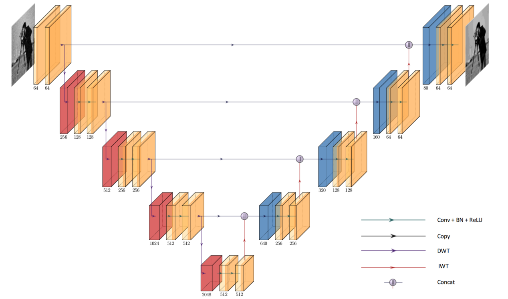
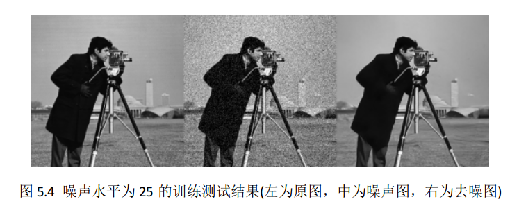

# 基于小波变换的Unet图像去噪

### 网络结构

### 数据集

	data/
	 ├── Train400
	 └── Test
	      ├── Set12
	      └── Set68
	 
借鉴自[DnCNN](https://github.com/cszn/DnCNN/tree/master/TrainingCodes/DnCNN_TrainingCodes_v1.0/data)， 训练时使用Train400，测试使用Set12。

### 训练

    python main.py --cuda --sigma 25
    
可选项

- **model** 使用模型, UNET / WTUNET， 默认是WTUNET
- **batch_size** batch大小，默认为110
- **train_data** 训练数据集目录
- **test_data** 测试数据集目录，下面再细分小目录
- **sigma** 高斯噪声的标准差
- **model_dir** 模型存储位置
- **epochs** 迭代次数，默认是110
- **lr** 学习率大小，默认是1e-3
- **result_dir** 测试结果存放路径

### 测试 

    python test.py
    
可选项

- **test_data** 测试数据集目录，下面再细分小目录
- **sigma** 高斯噪声的标准差
- **model_dir** 模型存储位置
- **model_name** 模型名称， 默认lastest.pth
- **result_dir** 测试结果存放路径

### 去噪结果

